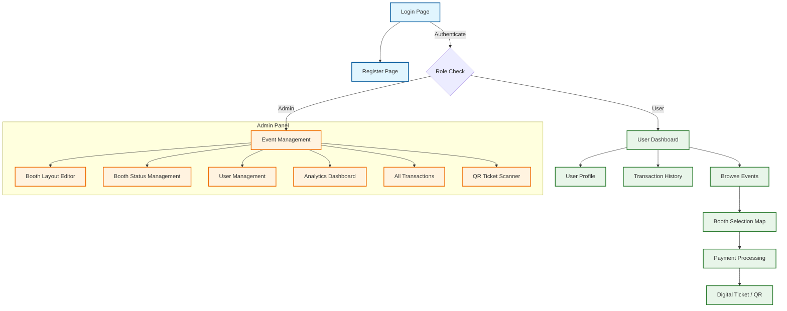

# Technical Stack Documentation - Hong Kong Food Carnival System

## Overview
This document outlines the technical stack used in the Hong Kong Food Carnival booth reservation system, a full-stack web application built for managing food carnival events and booth reservations.

## Frontend Technologies

### HTML5 & CSS3
- **HTML5**: Used for structuring the web pages with semantic elements
- **CSS3**: Provides modern styling capabilities including flexbox, grid layouts, and responsive design
- **Bootstrap 5**: CSS framework for responsive design, UI components, and mobile-first approach
- **EJS (Embedded JavaScript) Templates**: Server-side templating engine to generate dynamic HTML

### JavaScript
- **Client-side JavaScript**: For interactive UI components, form handling, and dynamic content
- **Chart.js**: JavaScript charting library for data visualization (served via CDN)
- **Socket.io Client**: For real-time updates in the analytics dashboard
- **html5-qrcode**: Library for scanning QR codes in the browser (served via CDN)
- **SVG Manipulation**: Used for interactive booth maps and floor plans

### External APIs & CDNs
Front-end libraries via CDN:
•	Bootstrap 5: UI framework served via jsDelivr CDN
•	Chart.js: Visualization library served via jsDelivr CDN
•	html5-qrcode: QR scanner library served via unpkg CDN

## Backend Technologies

### Node.js
- **Runtime Environment**: Server-side JavaScript runtime built on Chrome's V8 engine
- **Version**: Node.js with modern ES6+ features

### Express.js
- **Framework**: Web application framework for Node.js
- **Version**: Express 5.x (as indicated in package.json)
- **Middleware**: Extensive use of middleware for session management, cookie parsing, and static file serving
- **Routing**: RESTful API endpoints and view rendering routes

### NPM Packages (Backend Dependencies)

Core Framework: express, ejs
Security & Auth: bcrypt (hashing), express-session (sessions), cookie-parser, uuid (IDs)
Real-time: socket.io
Utilities:
- multer (File uploads)
- pdfkit (PDF generation for tickets)
- json2csv (Data export)
- qrcode (Server-side QR generation)

## Database

### JSON-based File Storage
- **Implementation**: Custom JSON file-based database system (db.json)
- **Structure**: Contains users, events, booths, bookings, and transactions
- **Data Management**: Custom data store module (data/store.js) with CRUD operations
- **Default Schema**: Predefined schema for events, booths, users, and booking systems
- **Scalability**: Simple file-based solution suitable for small to medium applications

## Version Control & Development

### Git / GitHub
- **Repository Management**: Version control using Git
- **Workflow**: Standard Git workflow with branching and merging
- **Hosting**: GitHub for remote repository hosting and collaboration
- **Best Practices**: Proper commit messages and branching strategies

## System Architecture

### Client-Server Architecture
- **Frontend**: HTML/CSS/JavaScript templates rendered server-side
- **Backend**: Node.js/Express server handling API requests and business logic
- **Database Layer**: JSON file-based persistence layer
- **Real-time Communication**: Socket.io for live analytics updates

### Key Features
- **User Authentication**: Secure login/registration with password hashing
- **Admin Dashboard**: Complete administrative controls for events and booths
- **Booth Reservation System**: Interactive SVG-based booth selection
- **Payment Processing**: Credit card payment simulation
- **Real-time Analytics**: Live dashboard with revenue and occupancy metrics
- **QR Code Integration**: Digital tickets with QR code validation
- **File Uploads**: Profile picture and image management
- **Data Export**: CSV and PDF export capabilities

## Security Features
- **Password Hashing**: BCrypt for secure password storage
- **Session Management**: Express-session with secure cookies
- **Input Validation**: Server-side validation and sanitization
- **Role-based Access**: Admin/user privilege separation
- **CSRF Protection**: Built-in Express middleware

## Deployment & Production Readiness
- **Environment Configuration**: Support for different environments (dev/prod)
- **Static File Serving**: Efficient serving of CSS, JS, and image assets
- **Error Handling**: Comprehensive error handling and logging
- **Performance**: Optimized rendering and efficient data handling

## Development Tools & Dependencies
- **NPM**: Package management
- **Development Dependencies**: As listed in package.json
- **Build Tools**: Simple setup with minimal build requirements
- **Testing**: Ready for integration with testing frameworks

This technology stack provides a robust, scalable solution for managing food carnival booth reservations with modern web development practices.

## Website Structure

